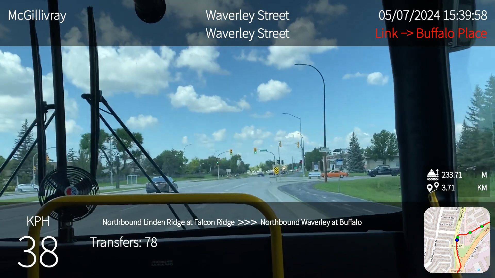

# tpov - Modules to help create transit POV videos

## [English Documentation](https://tpov.readthedocs.io/en/latest/) 

## [中文文档](https://tpov.readthedocs.io/zh_CN/latest/)    

tpov is a Python package to help with creating (public) transportation POV videos. It is recommended to work with OpenStreetMap map data and gopro-dashboard-overlay to create the video overlay, although it can be used with other data sources and video creation tools.

It supports generating route and intersection information from an OpenStreetMap map file, matching public transportation stops to the recorded track using GTFS, OpenStreetMap, or Baidu Maps data, and exporting the data in a .gpx file with custom extensions.

*A POV video generated using the default layout*