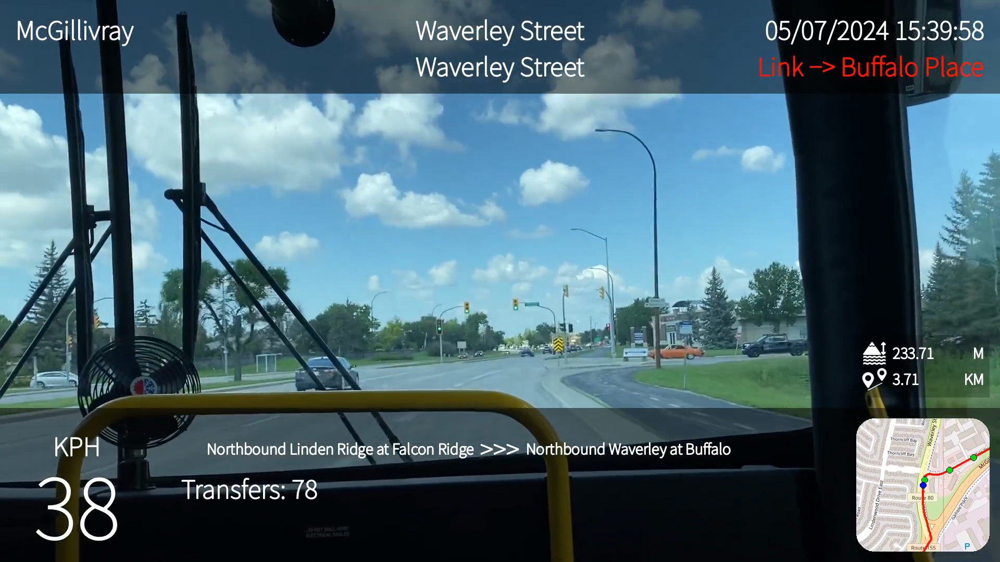

.. tpov documentation master file, created by
   sphinx-quickstart on Fri Jun 28 10:12:38 2024.
   You can adapt this file completely to your liking, but it should at least
   contain the root `toctree` directive.

tpov's documentation
================================

tpov is a Python package to help with creating \(public\) transportation POV videos. It is recommended to work with OpenStreetMap_ map data and gopro-dashboard-overlay_ to create the video overlay, although it can be used with other data sources and video creation tools.

It supports generating route and intersection information from an OpenStreetMap map file, matching public transportation stops to the recorded track using GTFS_, OpenStreetMap_, or `Baidu Maps`_ data, and exporting the data in a .gpx file with custom extensions.

   A POV video generated using the default layout

.. _OpenStreetMap: https://www.openstreetmap.org/
.. _gopro-dashboard-overlay: https://github.com/time4tea/gopro-dashboard-overlay
.. _GTFS: https://gtfs.org/
.. _Baidu Maps: https://maps.baidu.com/

.. toctree::
   :maxdepth: 2
   :caption: Contents:

   quickstart
   troubleshooting

Indices and tables
==================

* :ref:`genindex`
* :ref:`modindex`
* :ref:`search`
