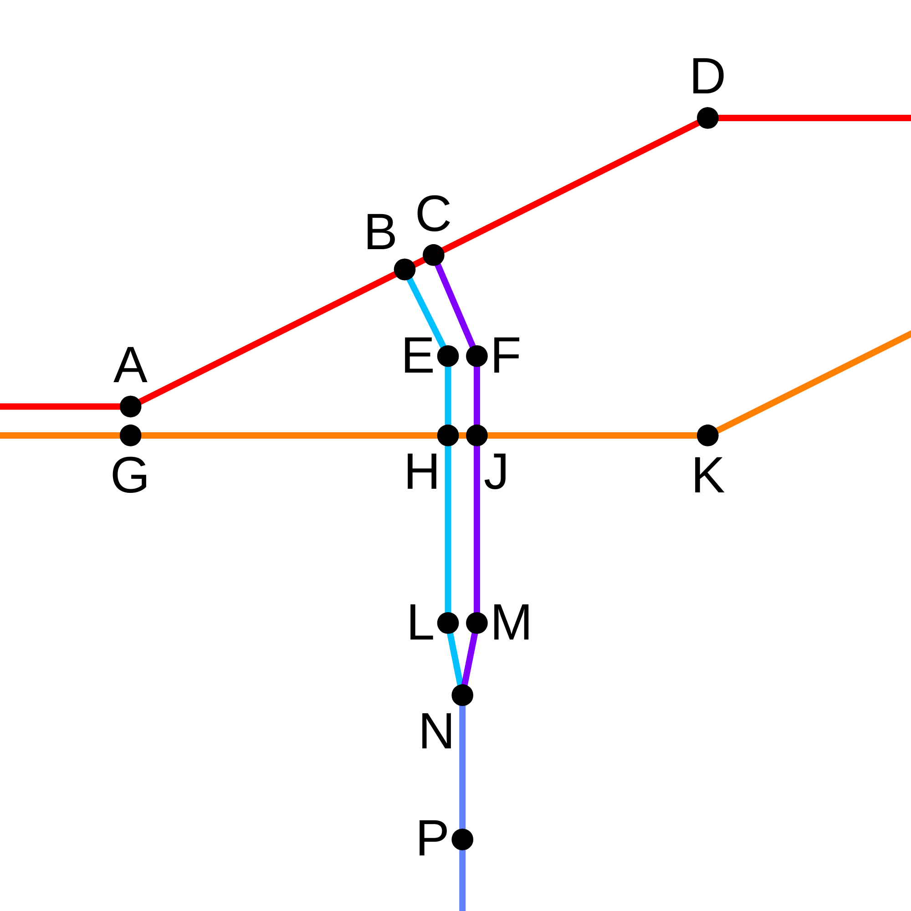

# 处理分隔式道路

分隔式道路指中间设有隔离带，两侧各有若干单向车道的道路。在 OpenStreetMap 中，分隔式道路以两条单向道路（`way` 对象）表示。这会导致识别路口时出现问题。`tpov_match.py` 中的 `divided_process` 函数与 `process_divided` 参数列表控制了是否在识别路口时包括或排除某些道路。

## 分隔式道路路口示例

下图展示了一条从双向变为分隔式的道路，与另一条分隔式道路以一个倾斜的丁字路口相交。行驶方向如下（**此图默认右行交通**）：

- 路1（东西向）：
    - G -> H -> J -> K（橙）
    - D -> C -> B -> A（红）
- 路2（南北向）：
    - P -> N -> M -> J -> F -> C（蓝 -> 紫）
    - B -> E -> H -> L -> N -> P（青 -> 蓝）

所有后续文档将参考下图。

*分隔式道路路口示例*